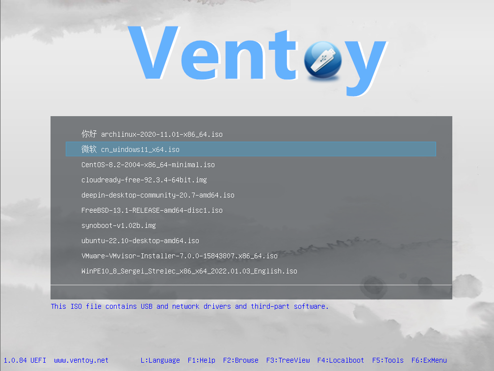
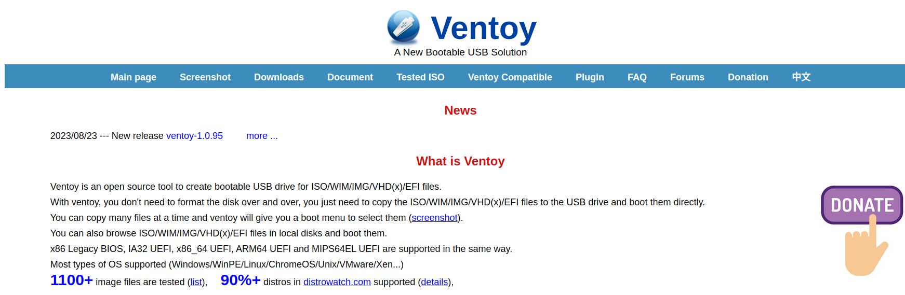
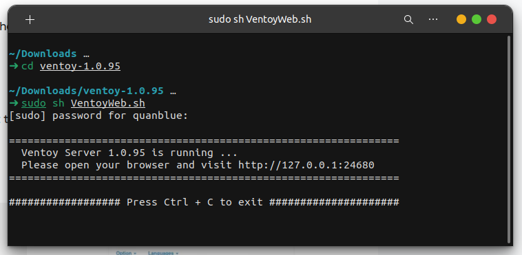
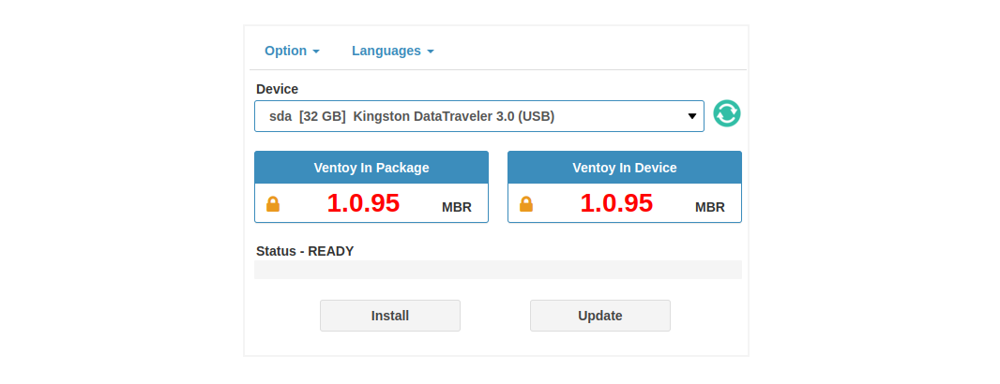
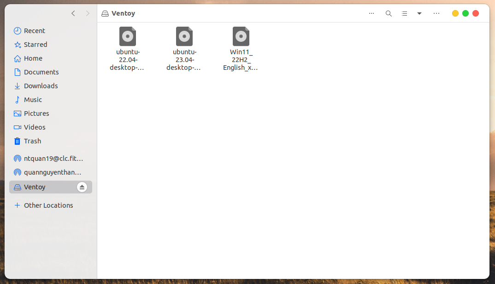

<h1> Creating Multiboot USB (Ventoy)</h1>

<b>Table of Contents</b>

- [Introduction](#introduction)
  - [What Is A Bootable USB?](#what-is-a-bootable-usb)
  - [What Is A Multiboot USB](#what-is-a-multiboot-usb)
  - [What Is Ventoy](#what-is-ventoy)
- [How to create a multiboot USB using Ventoy](#how-to-create-a-multiboot-usb-using-ventoy)
- [Credits](#credits)

## Introduction

Creating multi-boot USB is a common task for system admins. It can be used to install operating system on a target machine.

### What Is A Bootable USB?

**A bootable USB** is a USB drive that has been configured to contain a bootable operating system. The most common use for a bootable USB is to install an operating system, but they can also be used to run diagnostic tools and recovery utilities.

**Bootable USB drives** are created using a number of different methods, but the most common is to use a utility like Rufus or Universal USB Installer. These utilities will take an ISO file, which is a disc image of an operating system, and write it to the USB drive. Once the ISO is written to the USB drive, the drive will be bootable.

### What Is A Multiboot USB

**A multiboot USB** is a USB drive that has been configured to boot multiple operating systems on a single USB drive. This can be useful for troubleshooting or for testing different operating systems.

To create a multiboot USB, you will need to:

- <u>Step 1:</u> Create a bootable USB drive
- <u>Step 2:</u> Copy the desired operating system files to it.

There are a few things to keep in mind when creating a multiboot USB:

- First, you will need to make sure that the USB drive is large enough to hold all of the operating system files.
- Second, you will need to ensure that the USB drive is bootable. To do this, you will need to create a bootable USB drive using a tool like Rufus.
- Finally, you will need to copy the operating system files to the USB drive.

Once you have created a bootable USB drive, you can copy the operating system files to it. To do this, you will need to mount the ISO file for the operating system you want to install. Once the ISO is mounted, you can simply copy the contents of the ISO to the USB drive.

Once you have copied the operating system files to the USB drive, you can boot from it. To do this, you will need to change the boot order in your BIOS. Once the boot order is changed, you can boot from the USB drive and select the operating system you want to install.

### What Is Ventoy

Ventoy is a free and open source tool that:

- Allow create a bootable USB drive for running live Linux operating systems.
- Does not require you to extract the ISO file to create the bootable USB drive (different from other live USB creation tools).
- Supports booting from ISO files that are larger than 4GB (which is a limitation of many other live USB creation tools).

Download at [here](https://www.ventoy.net/en/index.html) or in [Github](https://github.com/ventoy/Ventoy/releases)

## How to create a multiboot USB using Ventoy

**Step 1:** Download ISOs (Operating System Disk Image) that you want to install.

- Windows: https://www.microsoft.com/en-gb/software-download
- Linux Distributions: https://www.linux.org/pages/download/

**Step 2:** Download and Run Ventoy (Bootable USB tool)

- Download:
  - Ventoy website: https://www.ventoy.net/en/download.html
  - Github: https://github.com/ventoy/Ventoy/releases
- Run:
  - Windows: Run `Ventoy2Disk.exe` as Administrator
  - Linux: Run `sudo sh VentoyWeb.sh`
    

**Step 3:** Flash Ventoy on the USB pen drive

- Insert your USB pen driver on machine
  > **<u>Warning:</u>** back-up of all the USB pen drive’s content as the application will **completely remove everything on the USB pen drive**.
- Open your driver and navigate to http://127.0.0.1:24680
- Select the USB pen drive from the `Device` list that you want to use for the ISOs installation and click on `Install`.
  

  > **Note:** Wait for at least a minute after the operation has been completed to make sure that the USB pen drive is not writing changes

**Step 4:** Copy the ISO file to the USB pen drive

- Now, your USB pen drive is rename to `Ventoy` and ready to use.
- Copy the ISO files to the `Ventoy` USB pen drive.
  
  --- Completed ---

# Credits

- [Ventoy](https://www.ventoy.net/en/index.html)
- Emojis are taken from [here](https://github.com/arvida/emoji-cheat-sheet.com)
